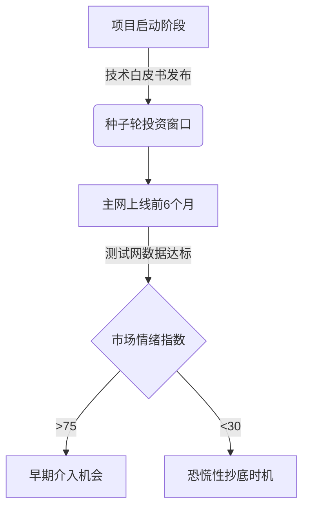

# 2025年值得关注的潜力加密货币榜单与追踪指南

在数字资产投资领域，掌握优质加密货币的动态至关重要。本文将为您梳理当前市场最具潜力的加密货币类型，解析投资前的必备知识，并提供实用的决策框架。

## 加密货币投资的核心考量因素

在选择加密货币时，投资者应重点关注以下维度：

1. **技术创新性**  
   - 是否采用革命性共识机制（如PoS 3.0、分片技术）
   - 智能合约平台是否支持跨链互操作
   - 隐私保护方案是否通过零知识证明等前沿技术验证

2. **团队与生态建设**  
   - 核心开发团队是否具备区块链底层架构经验
   - 是否获得知名风投机构战略投资
   - DApp生态活跃度（开发者数量/月度交易量）

3. **市场表现指标**  
   | 指标类型 | 分析维度 |
   |---|---|
   | 流动性指标 | 24小时交易量/订单簿深度 |
   | 价值指标 | FDV估值/市销率（P/S） |
   | 社群指标 | Telegram群组增长率/Twitter互动量 |

4. **合规化进程**  
   - 是否取得主要司法管辖区的合规牌照
   - 是否与传统金融机构建立合作
   - 监管沙盒参与情况

👉 [掌握最新区块链技术动态](https://bit.ly/okx_welcome)

## 当前市场重点关注领域

### Layer1公链赛道
- **以太坊杀手**：支持10万TPS以上的高性能公链
- **模块化架构**：采用Celestia等数据可用性方案的新型公链
- **绿色共识**：引入PoSt（时空证明）等低能耗机制

### DeFi基础设施
- **去中心化预言机**：支持多链数据交互的Chainlink竞品
- **自动化做市商**：引入集中流动性模型的DEX协议
- **衍生品协议**：支持永续合约的非托管交易平台

### NFT与Web3应用
- **动态NFT**：支持链下数据实时更新的协议层
- **元宇宙基建**：3D资产铸造与跨平台协议标准
- **社交代币**：基于去中心化社交图谱的内容激励机制

## 投资决策常见误区解析

### FAQ精选

**Q：市场排名靠前的加密货币是否更值得投资？**  
A：市值排名需结合项目基本面分析。2023年某排名第20的DeFi代币因协议漏洞导致市值蒸发90%，而同期排名50名外的隐私币因主网上线实现50倍涨幅。建议使用"市值-开发活跃度比值"等复合指标评估。

**Q：如何判断项目方是否在进行拉高出货？**  
A：观察链上大额转账记录与社交媒体推广节奏的关联性。当鲸鱼地址集中转入交易所时，若同步出现大量KOL推广，需警惕短期抛压风险。

**Q：熊市中该如何调整投资策略？**  
A：可采用"核心-卫星"配置：70%资金配置在抗跌性强的Staking资产，30%用于捕捉热点轮动。2022-2023年回测数据显示，该策略可降低35%的最大回撤。

👉 [获取专业级投资组合分析工具](https://bit.ly/okx_welcome)

## 风险控制实践指南

### 资金管理矩阵

| 风险等级 | 仓位建议 | 适用场景 |
|---|---|---|
| 保守型 | 5%-10% | 蓝筹币种定投 |
| 平衡型 | 15%-25% | 成熟DeFi协议 |
| 进取型 | 30%-40% | 新公链测试网阶段 |
| 激进型 | 50%+ | 早期NFT项目 |

### 技术分析工具推荐
- **链上分析**：Glassnode的MVRV比率、CoinMetrics的实体流
- **舆情监控**：TheTie的社交媒体情绪指数、LunarCrush的影响力评分
- **衍生品指标**：Bitfinex资金费率、Bybit永续合约持仓量变化

## 未来趋势前瞻

### 2025年三大技术突破方向
1. **量子抗性加密**：NIST标准算法的区块链应用
2. **AI驱动的AMM**：机器学习优化的做市商算法
3. **现实资产代币化**：房地产、碳信用等传统资产的链上映射

👉 [探索区块链技术前沿应用](https://bit.ly/okx_welcome)

### 政策监管动态
- 全球稳定币发行牌照申请进度
- 机构投资者准入门槛调整
- 交易所得税征收细则更新

## 价值投资实践案例

以某跨链协议代币为例，其2023-2024年表现分析：

1. **技术迭代**  
   完成从PoW到PoS的共识升级，TPS从150提升至2000

2. **生态扩张**  
   新增12个EVM兼容链支持，合作伙伴覆盖前5大钱包服务商

3. **财务数据**  
   协议收入季度复合增长率达43%，Treasury储备覆盖18个月运营开支

4. **市场表现**  
   实现从$0.8到$12.5的突破，期间经历3次重大回调但均获支撑

### 投资时点判断框架

通过系统化的分析框架与持续跟踪，投资者能在加密货币市场波动中把握确定性机会。建议每周预留3-5小时进行项目研究，使用Dune Analytics等工具构建个性化仪表盘，同时保持对宏观经济政策的敏感度。
