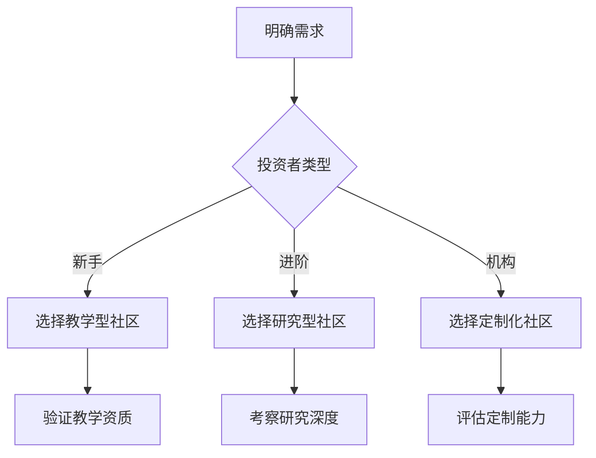

# 2025年荷兰最佳加密货币社区全解析

## 什么是加密货币社区？

加密货币社区是由共同关注区块链技术、数字资产投资的群体组成的专业交流平台。通过Discord、Telegram等工具，成员可以实时获取市场动态、技术分析及项目深度解读。这类社区通常配备专业管理员，确保信息传播的准确性和时效性。

> **核心价值**：社区成员通过信息共享构建知识网络，实现从入门到精通的阶梯式成长。

## 为什么选择Discord作为主平台？

Discord凭借其模块化架构成为加密货币社区首选平台，主要优势体现在：
1. **信息分级管理**：基础频道与付费专区隔离，保障内容质量
2. **实时互动功能**：支持文字、语音、屏幕共享等多维交流
3. **权限控制系统**：可针对不同会员等级开放专属分析报告

👉 [探索加密货币交易新机遇](https://bit.ly/okx_welcome)

## 加密货币社区为何日益重要？

在区块链技术快速迭代的当下，社区成为获取前沿信息的关键渠道：
- 每日处理超5000条行业动态的精准筛选
- 构建跨领域专家协作网络（开发者/投资人/分析师）
- 建立信息可信度评估体系（用户信誉评分系统）

## 加入加密货币社区的四大核心优势

| 优势维度       | 具体价值                                                                 |
|----------------|--------------------------------------------------------------------------|
| 信息时效性     | 提前12-48小时获取关键技术突破信号                                        |
| 认知升级       | 每周平均接收3-5次系统化交易策略培训                                       |
| 风险预警       | 实时监测市场异常波动，提前识别潜在风险                                    |
| 资源整合       | 连接全球优质项目方与机构投资者网络                                      |

### 深度功能解析
- **技术分析专区**：提供多周期K线解读与量化交易策略
- **项目孵化通道**：优先参与优质DeFi/NFT项目测试
- **实战模拟系统**：虚拟交易环境下的策略验证平台

## 主流社区平台横向对比

| 平台类型   | 用户规模       | 内容特性                     | 安全等级 |
|------------|----------------|------------------------------|----------|
| Discord    | 850万+活跃用户 | 结构化知识体系               | ★★★★☆    |
| Telegram   | 620万+群组     | 实时交易信号快发             | ★★★☆☆    |
| Reddit     | 280万+讨论区   | 民主化信息筛选机制           | ★★★★☆    |
| 自建平台   | 定制化规模     | 专属数据加密与API接口集成    | ★★★★★    |

## 荷兰Top3加密货币社区深度评测

### 1. DoopieCash - 专业投资者社区标杆
- **会员体系**：基础版免费，Platinum尊享版（22.4k+会员）
- **核心功能**：
  - 每周4次实时交易直播
  - 独家Backtests历史回测系统
  - 跨市场套利策略数据库
- **特色服务**：Formula1赛事与加密市场的关联性分析

👉 [获取专业交易工具包](https://bit.ly/okx_welcome)

### 2. MoneyTalks - 新手进阶首选
- **教学体系**：7天入门计划（首周仅需1欧元）
- **服务亮点**：
  - Madelon Vos团队每周宏观经济解读
  - 个性化投资组合诊断
  - 200+加密货币技术分析模板
- **社区规模**：2000+活跃交易者

### 3. WhatsNext Community - 机构级信息源
- **创始背景**：荷兰金融精英闭门社群演变
- **专业优势**：
  - 每日市场情绪指数
  - 机构级链上数据分析
  - 定向空投资格获取通道
- **会员构成**：8500+专业投资者

## 常见问题解答

**Q：如何判断社区信息的可靠性？**  
A：观察内容生产者的验证机制，优质社区通常具备：
- 专家认证标识系统
- 交易记录可追溯性
- 多维度数据交叉验证

**Q：付费社区是否值得投资？**  
A：建议采用3:2:1筛选法则：
- 30%基础功能免费体验
- 20%核心内容试用期
- 1次完整周期跟踪验证

**Q：如何避免社区中的误导信息？**  
A：建立三层防护机制：
1. 多源信息交叉验证
2. 设置预警信号过滤器
3. 采用区块链浏览器二次确认

**Q：选择社区时应关注哪些指标？**  
A：重点考察四项核心指标：
| 指标类型       | 参考标准               |
|----------------|------------------------|
| 活跃度         | 日均消息量>500条       |
| 专业度         | 持证分析师占比>15%     |
| 时效性         | 重大事件响应<15分钟    |
| 转化率         | 有效交易信号成功率>62% |

**Q：如何最大化社区价值？**  
A：实施"3T"策略：
- Time management（时间分配）
- Topic focus（主题深耕）
- Training cycle（周期训练）

## 社区选择决策树

## 未来发展趋势预测

1. **AI辅助分析**：2025年Q2将有50%社区部署智能投顾系统
2. **跨链整合**：多生态系统的数据融合成为标配
3. **合规化运营**：持牌经营将成为欧洲社区准入门槛

👉 [抢先体验智能交易系统](https://bit.ly/okx_welcome)

## 投资者行动指南

**入门三步法**：
1. 选择2-3个社区进行1个月对比测试
2. 跟踪验证10个交易信号的准确性
3. 建立个性化信息筛选矩阵

**风险控制要点**：
- 单社区信息权重不超过总决策依据的30%
- 设置动态止损阈值（建议初始值8%）
- 每月进行投资组合压力测试
