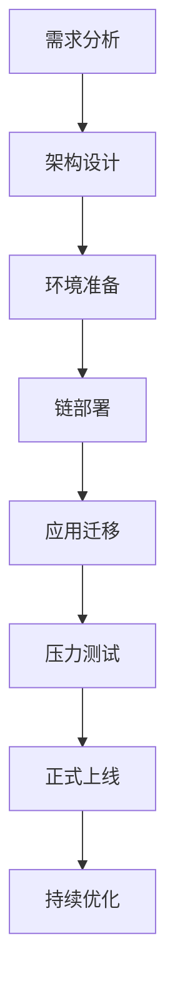

# Polygon zkRollups全面解析：打造高效以太坊二层扩展解决方案

## 一、Polygon zkRollups技术架构与核心优势

### 1.1 技术原理与创新特性
Polygon zkRollups采用零知识证明技术，通过链下计算+链上验证的模式，将交易吞吐量提升至3000-20000 TPS。其核心优势体现在：
- **成本降低90%**：批量处理交易显著减少Gas费用
- **安全性保障**：采用STARKs证明系统，无需信任第三方
- **EVM兼容性**：支持Solidity智能合约无缝迁移

👉 [了解更多Zeeve服务详情](https://bit.ly/okx_welcome)

### 1.2 zkValidium与zkRollup对比
| 特性                | zkValidium                      | zkRollup                     |
|---------------------|---------------------------------|------------------------------|
| 数据可用性          | 链下存储（数据委员会保障）      | 链上存储                     |
| 安全等级            | 企业级（适合高吞吐场景）        | 最高（适合金融级应用）       |
| 交易确认时间        | <3秒                            | <15秒                        |
| 典型应用场景        | 游戏、支付、DePIN               | DeFi、交易所、NFT市场        |

## 二、Zeeve区块链即服务平台（RaaS）深度解析

### 2.1 全生命周期管理解决方案
Zeeve平台提供从部署到运维的一站式服务：
1. **快速部署**：通过可视化向导实现15分钟内完成L2链部署
2. **智能运维**：配备AI驱动的监控系统，实现99.99% SLA保障
3. **弹性扩展**：支持按需升级TPS性能，最高可达20,000+

### 2.2 企业级安全架构
- **合规认证**：ISO27001、SOC2 Type2、GDPR三级认证体系
- **基础设施安全**：分布式节点部署+量子抗性加密算法
- **灾备方案**：跨云容灾（AWS/Azure/GCP）+热备份切换

👉 [查看区块链部署案例](https://bit.ly/okx_welcome)

## 三、行业应用案例分析

### 3.1 Web3游戏基础设施
Pentagon Games通过部署zkRollup实现：
- 每秒处理15,000+游戏内交易
- 降低90%的玩家Gas成本
- 实现跨游戏资产互通

### 3.2 支付系统升级
Wirex测试网部署成果：
- 稳定币交易确认时间缩短至2.8秒
- 处理成本降至$0.0001/笔
- 支持每月超$10亿交易量

### 3.3 去中心化金融平台
Okto平台关键数据：
- 支持1200万+钱包地址
- 聚合50+DeFi协议
- 实现跨链资产即时清算

## 四、技术选型指南与实施建议

### 4.1 选择zkRollups的五大考量因素
1. **业务规模**：日均交易量>10万笔时成本优势显著
2. **合规需求**：需要符合ISO27001等认证体系
3. **开发能力**：提供TypeScript/Python SDK支持
4. **跨链需求**：内置LXLY桥接协议，支持30+主流链
5. **未来扩展**：兼容AggLayer等聚合层技术

### 4.2 部署实施路线图

## 五、常见问题解答（FAQ）

### Q1：部署Polygon zkRollup需要多长时间？
A：通过Zeeve平台可视化部署工具，标准配置下可在**15分钟内完成**基础链部署。复杂业务场景（如定制化共识算法）通常需要2-3个工作日。

### Q2：如何保障链上数据隐私？
A：Polygon CDK支持三种隐私模式：
- 公共链模式（完全透明）
- Validium模式（数据委员会存储）
- Volition模式（选择性公开）

👉 [获取隐私方案对比表](https://bit.ly/okx_welcome)

### Q3：现有应用如何迁移？
A：迁移流程分为三阶段：
1. **兼容性评估**：智能合约审计+Gas模型分析
2. **工具链配置**：部署Hardhat+zkSync开发插件
3. **渐进式迁移**：采用双链并行机制，确保业务连续性

### Q4：如何实现跨链交互？
A：通过LXLY桥接协议实现：
- 原生资产跨链（<15分钟确认）
- NFT跨链（支持ERC-721/1155）
- 消息传递（支持任意智能合约调用）

## 六、行业趋势与未来展望

### 6.1 技术演进方向
- **证明系统优化**：Boojum升级使证明生成速度提升3倍
- **模块化架构**：支持DA层（Celestia）、执行层（zkVM）分离
- **AI集成**：智能Gas费预测算法（即将推出）

### 6.2 市场发展预测
| 指标                | 2023年    | 2024年（预测） |
|---------------------|-----------|----------------|
| zkRollups TVL       | $45亿     | $180亿         |
| 月交易量            | 28亿笔    | 120亿笔        |
| 企业采用率          | 12%       | 35%            |

## 七、商业合作与生态发展

### 7.1 Zeeve生态合作伙伴计划
- **技术认证计划**：提供官方SDK和API文档
- **市场推广支持**：联合营销资源+案例白皮书
- **收益共享机制**：推荐客户可获15%佣金

### 7.2 开发者资源
- **开发文档中心**：包含200+技术示例
- **沙箱环境**：免费测试网络（含1000个测试节点）
- **开发者社区**：每周技术直播+专家答疑

通过以上深度解析可见，Polygon zkRollups结合Zeeve平台的RaaS服务，正在重塑企业级区块链应用的开发模式。无论是初创项目还是大型企业，都能通过这套解决方案实现高性能、低成本、安全可靠的区块链部署。