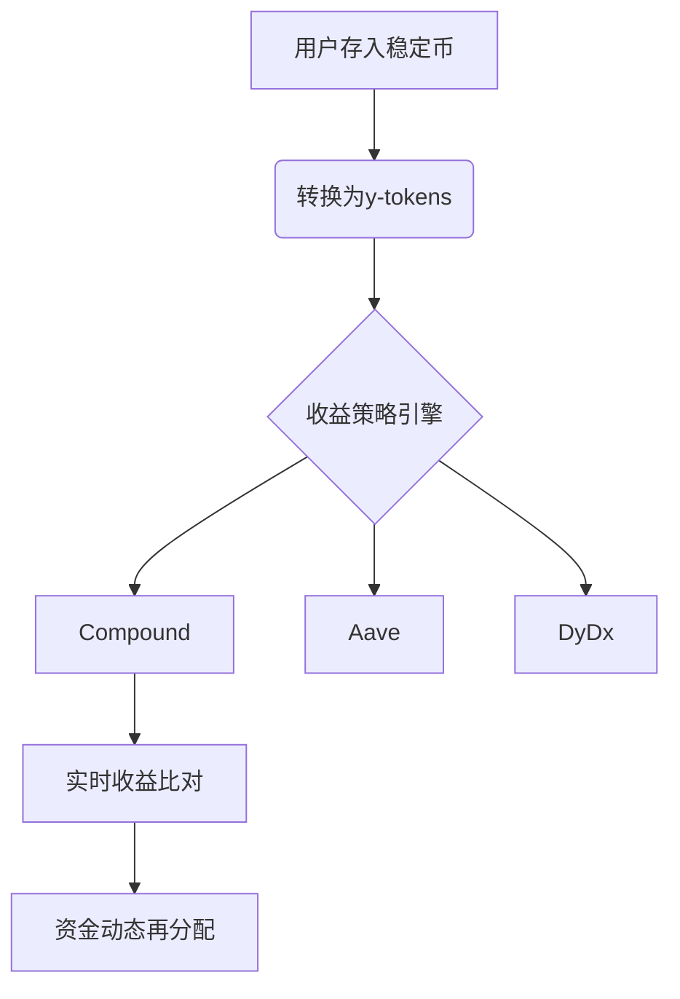

# yearn.finance深度解析：YFI代币、运作机制与投资指南

## 什么是yearn.finance？

yearn.finance作为去中心化金融（DeFi）领域的标杆性平台，通过创新性的资产管理解决方案重构了加密货币收益模式。其核心功能覆盖流动性供应、借贷聚合和保险服务，其中以**收益优化型Vaults**最为突出。该平台通过社区驱动的策略算法，将用户资产动态分配至收益最高的DeFi协议，目前已实现对Compound、Aave等主流协议的智能调度。

平台原生代币YFI不仅是治理权凭证，更承载着平台生态的激励机制。截至当前，YFI流通量达33,809枚，总量上限36,666枚的设计确保了稀缺性价值。

👉 [深度解析加密货币投资策略](https://bit.ly/okx_welcome)

## yearn.finance发展历程

### 创始阶段（2020年）
由独立开发者Andre Cronje于2020年2月推出的iEarn，初期即实现800万美元的TVL（总锁定价值）。在经历短暂的社区争议后，Cronje通过修复漏洞重构平台，正式更名为yearn.finance。

### 里程碑事件
- **2020年7月**：推出治理代币YFI，创DeFi领域无预挖先例
- **V2版本升级**：引入智能储蓄账户Vaults，yUSD产品首日TVL突破6亿美元
- **社区治理转型**：初始由Cronje独掌的代币发行权，逐步过渡至包含9名核心成员的多重签名管理机制

### 关键转折点
2020年8月Cronje因过度劳累暂停开发，但平台治理机制展现出强韧性。至2022年，核心开发者Anton Nell宣布退出，标志着创始团队完成使命交接。

## 运作机制解析

### 核心架构
yearn.finance通过三层架构实现资产最优配置：
1. **收益聚合层**：实时监测DeFi市场利率波动
2. **智能路由层**：动态调整资金流向高收益池
3. **风险管理层**：内置保险机制对冲协议风险

### 收益优化流程

### 收益分配模型
- **协议费用**：收取0.5%管理费+5%收益分成
- **YFI持有者权益**：享有治理投票权及协议收益分成
- **安全机制**：开源代码经CertiK等机构审计，多重签名保障资金安全

👉 [探索更多DeFi创新应用](https://bit.ly/okx_welcome)

## 核心产品矩阵

| 产品类型 | 功能特点 | 收益模式 |
|---------|----------|----------|
| Vaults  | 智能收益优化器 | 动态资金调度 |
| Earn    | 收益率聚合器 | 跨协议套利 |
| Zap     | 协议切换工具 | 滑点最小化 |
| yInsure | 去中心化保险 | 风险对冲池 |

## YFI代币经济学

### 分配机制
- 初始发行：30,000枚均分给早期用户及流动性提供者
- 线性释放：无预挖设计，完全社区化分配
- 激励模型：通过协议收益反哺代币持有者

### 治理机制
- 提案门槛：500枚YFI
- 投票周期：72小时
- 通过标准：51%多数决

## 投资价值评估

### 优势分析
- **先发优势**：DeFi收益聚合赛道开创者
- **技术壁垒**：动态策略引擎专利技术
- **社区效应**：活跃开发者生态持续创新

### 风险因素
- **监管不确定性**：全球DeFi监管框架尚不明确
- **智能合约风险**：依赖第三方协议安全性
- **市场竞争**：Convex、Harvest等竞品崛起

👉 [获取专业加密货币分析报告](https://bit.ly/okx_welcome)

## FAQ

**Q：如何参与yearn.finance治理？**  
A：持有YFI代币即可参与DAO治理投票，需通过Snapshot平台提交治理提案。

**Q：使用Vaults产品是否需要支付Gas费？**  
A：存取款操作需支付以太坊网络Gas费，平台会动态优化交易策略以降低费用。

**Q：收益优化策略如何确保资金安全？**  
A：采用多重安全措施：代码审计、保险基金池、白名单协议机制。

**Q：YFI代币未来增发计划？**  
A：总量固定36,666枚，无增发计划，稀缺性保障价值捕获能力。

## 市场表现追踪

| 指标         | 数据               |
|--------------|--------------------|
| 当前价格     | $5,114.56 USD      |
| 24小时交易量 | $15.18M USD        |
| 市场排名     | #43                |
| TVL          | $8.2B USD          |

## 投资者操作指南

1. **资产配置**：建议将DeFi资产的30-50%配置于Vaults产品
2. **风险控制**：分散投资于不同类型的Vaults（稳定币、ETH质押等）
3. **收益策略**：定期关注YFI治理投票，把握新策略上线机会
