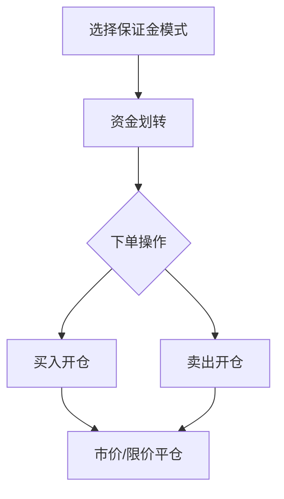

# 欧易杠杆交易保证金

## 一、币币杠杆交易解析
币币杠杆交易是数字资产领域的重要投资工具，通过质押自有资产获取杠杆额度，实现资金放大效应。在欧易OKX平台，用户可获得最高10倍杠杆资金，有效提升资产运作效率。需要特别注意的是，杠杆交易在放大收益的同时，也会同比例放大风险，因此建议投资者严格设置止盈止损策略。

👉 [掌握专业交易工具](https://bit.ly/okx_welcome)

### 核心运作机制
1. **双向交易**：支持做多（买入开仓）与做空（卖出开仓）两种操作模式
2. **保证金体系**：提供单币种/跨币种/组合保证金三种账户模式选择
3. **自动清算**：系统实时监控保证金率，触发清算阈值将自动平仓

## 二、交易场景应用
### 1. 看涨行情操作（做多）
当预判某币种价格将上涨时：
- 质押USDT等稳定币作为保证金
- 借入目标币种并即时买入
- 等待价格上涨后卖出获利
- 偿还借入币种及利息后剩余为收益

### 2. 看跌行情操作（做空）
当预判某币种价格将下跌时：
- 质押ETH等主流币作为保证金
- 借入目标币种并立即卖出
- 等待价格下跌后买入归还
- 偿还币种差价及利息后获得收益

### 3. 操作流程优化
统一账户体系将传统四步操作（借币→买卖→平仓→还币）简化为：


## 三、交易模式详解
### 保证金模式对比

| 模式类型       | 风险隔离 | 资金利用率 | 适用场景             |
|----------------|----------|------------|----------------------|
| 单币种保证金   | 高       | 中等       | 单一币种深度操作     |
| 跨币种保证金   | 中       | 高         | 多币种组合投资       |
| 组合保证金     | 低       | 最高       | 复杂策略组合操作     |

### 利息计算规则
- **计息频率**：每小时整点计息，每日8/16/24时扣款
- **利率差异**：根据用户VIP等级和借币类型动态调整
- **负债处理**：跨币种模式需通过现货交易补足负债

👉 [查看实时利率表](https://bit.ly/okx_welcome)

## 四、风险控制指南
### 1. 保证金率管理
系统清算阈值为110%，建议保持保证金率在150%以上。可通过以下公式计算：
```
保证金率 = (总资产价值) / (负债价值 × 维持保证金率系数)
```

### 2. 止盈止损设置
- 动态调整策略：根据市场波动率设置弹性区间
- 分仓操作：将大单拆分为多个小单分散风险
- 时间止损：设置最长持仓周期避免隔夜风险

### 3. 市场监测要点
- 关注交易所公告的借币利率变动
- 跟踪主流币种资金费率变化
- 监控全球宏观经济政策动态

## 常见问题解答
**Q：如何选择最优保证金模式？**  
A：新手建议从单币种模式开始，熟悉后可尝试跨币种模式。组合模式适合专业投资者进行套利操作。

**Q：利息计算是否会产生复利？**  
A：平台采用单利计息方式，每小时计算的利息不会产生复利效应。

**Q：清算时如何降低损失？**  
A：建议提前设置自动追加保证金功能，或保持账户有充足备用资金。

**Q：是否支持自动还款？**  
A：系统在平仓时会自动扣除借币本金和利息，无需手动操作。

**Q：如何查看实时负债情况？**  
A：在「资产」页面的「负债管理」模块可实时查看各币种负债详情。

👉 [体验智能交易系统](https://bit.ly/okx_welcome)

## 五、交易策略建议
### 1. 趋势跟踪策略
- 选择交易量排名前20的币种
- 设置20日均线作为趋势判断依据
- 采用金字塔加仓法控制仓位

### 2. 套利交易策略
- 利用跨交易所价差进行套利
- 关注期货合约与现货价差
- 把握市场恐慌时的溢价机会

### 3. 波动率交易策略
- 监测市场恐慌指数VIX
- 在低波动期建立跨式组合
- 高波动期采用反向对冲

## 附录：费率参考表

| 费率类型       | 标准费率  | VIP等级影响 | 特殊说明         |
|----------------|-----------|-------------|------------------|
| 交易手续费     | 0.1%-0.2% | 降低至0.02% | 持OKB可享折扣    |
| 借币利率       | 0.001%-0.1% | 降低30%-50% | 与抵押率相关     |
| 平台服务费     | 无        | -           | 所有用户统一     |

（注：以上费率数据为示例，实际以平台公告为准）

通过系统化的风险管理、科学的仓位控制以及灵活的策略组合，投资者可以在欧易OKX平台充分发挥杠杆交易的优势。建议新手从1-3倍杠杆开始实践，逐步提升操作熟练度后再增加杠杆比例。